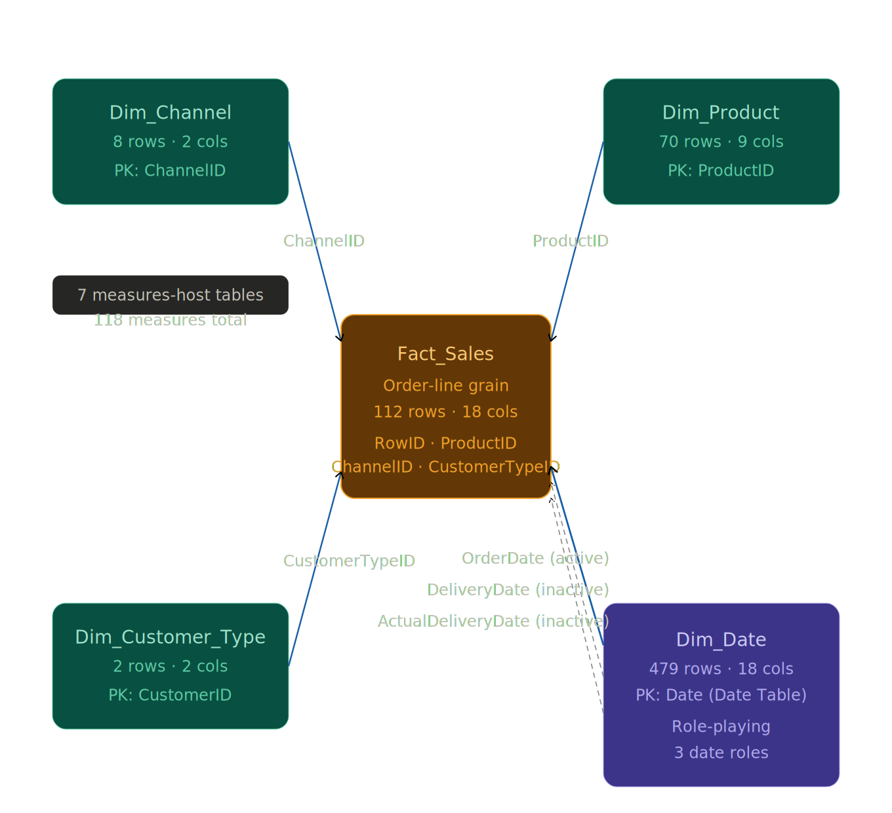
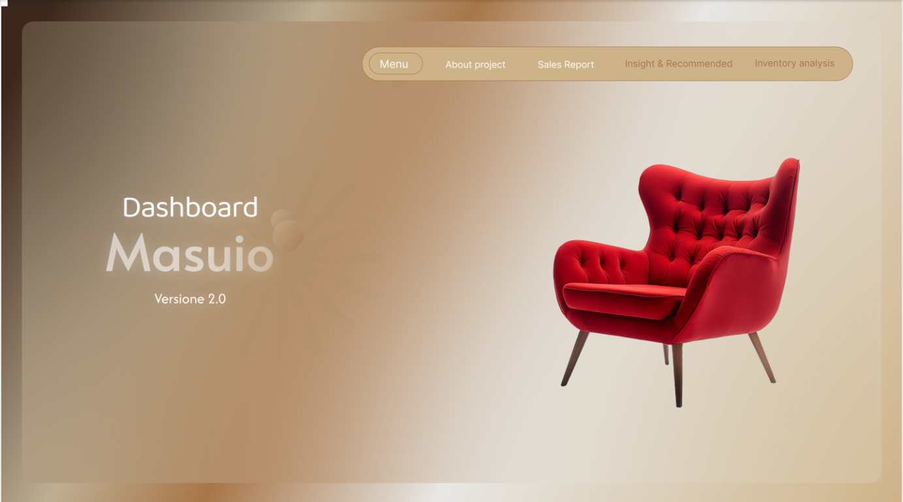
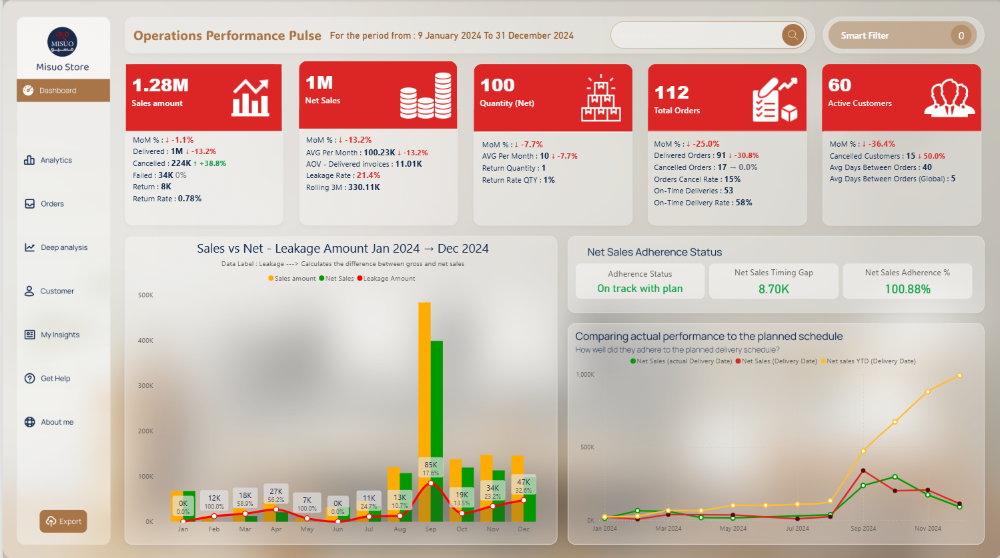
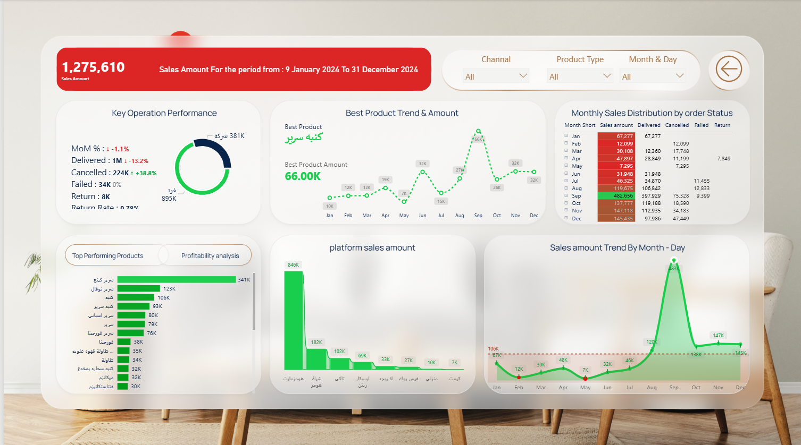
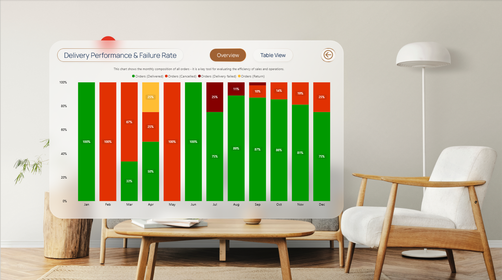
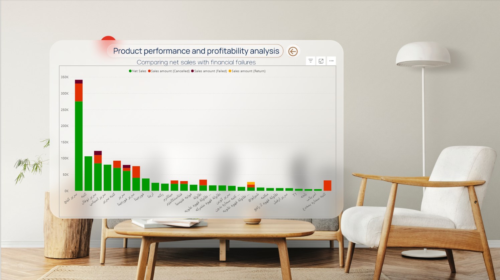

# Masseo — E-commerce Furniture Sales Analysis

> **A 118-measure Power BI semantic model turning a 16-month order ledger into an operations-grade view of revenue leakage, delivery adherence, and customer repeat behaviour.**


---

## 1. Context

- **Client / Domain:** E-commerce Furniture Retail — Masseo (multi-channel Egyptian furniture operation)
- **Project Type:** Freelance delivery
- **Timeline:** October 2025 – January 2026
- **Tools:** Power BI Desktop, Power Query (M), DAX, Excel, Tabular Editor
- **Role:** Sole Data Analyst / BI Developer
- **Delivery:** Interactive Power BI report (5 pages: Menu · Operations Performance Pulse · Sales Report · Insight & Recommended · Inventory Analysis) with bilingual (AR/EN) data and a 7-folder measure architecture covering revenue, leakage, delivery performance, role-playing-date analytics, customer retention, and month-over-month presentation

---

## 2. Problem Statement

Masseo was selling across eight channels (marketplaces, retail partners, social, and direct) with a single team handling orders, deliveries, and returns — but had no single operational view capable of answering four recurring questions: *Where is the revenue leaking between order and delivery? Which channels and products concentrate the most value? Are we delivering on the promised dates? Are customers coming back, and how often?* The raw data lived as folder-based Excel files at order-line grain, mixing order dates, promised-delivery dates, and actual-delivery dates on the same row with no dimensional model and no standardized KPI definitions.

This project delivered a star-schema semantic model with a role-playing date dimension plus a comprehensive measure library that closes those gaps and makes leakage, schedule adherence, and retention first-class operational KPIs.

---

## 3. Data Sources

| Source | Format | Grain | Records | Notes |
|---|---|---|---|---|
| Order ledger (`Fact_Sales`) | `.xlsx` | Order-line | 112 rows | Contains order/delivery/actual-delivery dates, status, price × quantity, channel, customer type, governorate |
| Product master (`Dim_Product`) | `.xlsx` | SKU | 70 rows | Product type · fabric colour · metal colour · size |
| Channel master (`Dim_Channel`) | `.xlsx` | Channel | 8 rows | Marketplace / retail / social / direct |
| Customer type master (`Dim_Customer_Type`) | `.xlsx` | Segment | 2 rows | فرد (Individual) · شركة (Company) |
| Calendar (`Dim_Date`) | Generated in Power Query (M) | Daily | 479 rows | Saturday-start week convention · 2024-01-09 → 2025-05-01 |

**Fact table coverage:** EGP 1,275,610 gross sales · EGP 1,002,334 net sales · 112 orders · 91 delivered · 17 cancelled · 3 delivery-failed · 1 returned · 76 distinct customers.

---

## 4. Methodology (4D Cycle)

### Discover
Profiled the source Excel files for grain, null patterns, and status-value distribution. Confirmed one fact row represents one `RowID × ProductID` line (multi-line orders split across rows). Verified four discrete `Status` values drive every downstream filter: Delivered, Return, Cancelled request, Delivery failed. Found three date columns on every row (`OrderDate`, `DeliveryDate`, `ActualDeliveryDate`) — identified that analysing revenue on each date axis separately was required to answer schedule-adherence questions, which drove the role-playing date decision in Design. Spotted that `sellingPrice` occasionally diverged from the expected price list and surfaced an `IncorrectSellingPrice` audit column for governance.

### Design
Adopted Kimball-style star schema. The Excel load was normalized into one fact (`Fact_Sales`) plus four dimensions (`Dim_Date`, `Dim_Product`, `Dim_Channel`, `Dim_Customer_Type`). Natural keys were preserved because `ProductID` and `ChannelID` are already stable upstream identifiers — no surrogate layer was added. `Dim_Date` was designed as a role-playing dimension: one physical date dimension, three relationships to the fact (only `OrderDate` active; `DeliveryDate` and `ActualDeliveryDate` activated on-demand via `USERELATIONSHIP`). Seven measures-host tables were scoped around functional groups — `Measured`, `Orders analysis`, `Delivery performance`, `Assumptions - Dependencies`, `Test` (role-playing analytics), `MoM %`, `Dynamic Title` — driving a clean Fields pane per theme.

### Develop
Power Query built the Saturday-start calendar with `DayOfWeek_SatStart` and `Start of Week (Sat)` helpers reflecting Egyptian retail-week conventions. The measure library was built in layers — base aggregations (`Sales amount`, `Sales amount (Delivered)`) first, then the `Net Sales` / `Leakage Amount` / `Leakage Rate %` revenue-integrity measures, then the delivery-performance group (`Lead Time (Days)`, `On-Time Deliveries`, `Late Deliveries`), then customer-retention measures built on a two-level `SUMMARIZE + ADDCOLUMNS` pattern (`Avg Days Between Orders`, `Frequnecy Segment`), and finally the presentation layer (47 MoM % measures covering 15 KPIs in value/label/colour triplets). The `Test` group was added last to expose the role-playing-date comparison as three measures (`Net Sales (Delivery Date)`, `Net Sales (actual Delivery Date)`, `Net Sales Adherence % (Delivery vs Actual)`).

### Deliver
KPI cards were paired with MoM label + colour measures so every card surfaces its direction and delta in a single read. A unified palette was applied across all status/threshold helpers: `#16A34A` green for improvement, `#DC2626` red for decline, `#F59E0B` amber for warning bands, `#6B7280` grey for blanks. The `Leakage Rate Color` and `Net Sales Adherence Status Color` measures apply traffic-light thresholds directly to cards without requiring per-visual conditional-formatting rules. Dynamic title measures (`Dynamic Title`, `Title (Visible Period)`) adapt the report header to whatever period the user has selected, and the `Count Active Filters` / `Count Active Filters Tooltip` pair surfaces exactly which slicers are active without requiring the user to hunt for them.

---

## 5. Data Model



Star schema with a single fact table (`Fact_Sales`, 112 rows) connected to four dimensions via natural keys. `Dim_Date` is a role-playing dimension with one active relationship (`OrderDate`) and two inactive relationships (`DeliveryDate`, `ActualDeliveryDate`) activated on-demand via `USERELATIONSHIP`. `Dim_Date` is marked as the Date Table to enable time intelligence across the entire measure library. Full documentation: [`03_data_model/relationships.md`](03_data_model/relationships.md).

---

## 6. Key Measures (Sample)

Documented using KPI Chain — Plain → Logic → DAX:

**Net Sales**
- Plain: The headline revenue KPI — money that was actually delivered and kept.
- Logic: Delivered revenue minus returned revenue. Cancelled and Failed orders are already excluded because they are not in the Delivered pool.
- DAX:
```DAX
Net Sales = 
[Sales amount (Delivered)] - [Sales amount (Return)]
```

**Leakage Rate %**
- Plain: Share of gross revenue that never became net revenue — the cancel/fail/return drag on the top line. Traffic-light bands: <5% green · 5–15% amber · >15% red.
- Logic: `(Gross − Net) ÷ Gross`. Guarded against zero/blank gross to avoid misleading results on empty filter contexts.
- DAX:
```DAX
Leakage Rate % = 
VAR g = [Sales amount]
VAR n = [Net Sales]
RETURN
    IF ( NOT ISBLANK ( g ) && g <> 0, DIVIDE ( g - n, g ), BLANK () )
```

**Net Sales Adherence % (Delivery vs Actual)**
- Plain: Did the realised revenue arrive on the dates the operations team promised? 100% means the schedule was hit exactly.
- Logic: Actual-delivery-date revenue ÷ promised-delivery-date revenue, using `USERELATIONSHIP` to activate two otherwise-inactive date relationships in the same model.
- DAX:
```DAX
Net Sales Adherence % (Delivery vs Actual) = 
VAR Planned = [Net Sales (Delivery Date)]
VAR Actual  = [Net Sales (actual Delivery Date)]
RETURN
    DIVIDE ( Actual, Planned )
```

**Agent Performance Score**
- Plain: The typical gap in days between a customer's own repeat orders — the repeat-purchase interval.
- Logic: Two-level `SUMMARIZE + ADDCOLUMNS` pattern: group delivered orders by customer, compute each customer's first-to-last order span and distinct-date count, then average the per-customer `span ÷ (orders − 1)` ratio. `ALLSELECTED` ensures slicer context flows through.
- DAX:
```DAX
Avg Days Between Orders = 
VAR __delivered =
    FILTER ( ALLSELECTED ( Fact_Sales ), Fact_Sales[Status] = "Delivered" )
VAR __per_customer =
    ADDCOLUMNS (
        SUMMARIZE ( __delivered, Fact_Sales[CustomerName] ),
        "@min", CALCULATE ( MIN ( Fact_Sales[OrderDate] ), __delivered ),
        "@max", CALCULATE ( MAX ( Fact_Sales[OrderDate] ), __delivered ),
        "@n",   CALCULATE ( DISTINCTCOUNT ( Fact_Sales[OrderDate] ), __delivered )
    )
VAR __with_span =
    ADDCOLUMNS ( __per_customer, "@span", DATEDIFF ( [@min], [@max], DAY ) )
RETURN
    AVERAGEX ( __with_span, DIVIDE ( [@span], [@n] - 1 ) )
```

> Full measure documentation (30 core measures in KPI-Chain format): [`03_data_model/dax_measures.md`](03_data_model/dax_measures.md)
> Data dictionary for all 118 measures: [`03_data_model/data_dictionary.md`](03_data_model/data_dictionary.md)

---

## 7. Dashboard Preview

The report is a 5-page navigable experience with a persistent top navigation bar (Menu · About project · Sales Report · Insight & Recommended · Inventory analysis). All pages share a warm gold-and-cream theme with glass-card styling and conditional colour encoding (green/amber/red) aligned with the performance thresholds built into each KPI.

### Page 1 — Menu (Home)



Landing page with the "Dashboard Masuio · Version 2.0" identity, product imagery, and the top navigation bar linking to all report sections.

### Page 2 — Operations Performance Pulse



Five KPI cards across the top row: **Sales Amount 1.28M · Net Sales 1M · Quantity Net 100 · Total Orders 112 · Active Customers 60** — each carrying MoM %, sub-KPIs (delivered / cancelled / failed / return breakdowns), and contextual metrics (AOV, Leakage Rate, On-Time Delivery Rate, Cancel Rate). Below the KPI row: a Sales vs Net / Leakage Amount waterfall chart (Jan–Dec 2024, annotated with per-month Leakage %), and a Net Sales Adherence panel (Adherence Status "On track with plan" · Timing Gap 8.70K · Adherence 100.88%) with the three-axis delivery-schedule comparison chart.

### Page 3 — Sales Report (Amount & Product Views)



Sales Amount view: header KPI card (EGP 1,275,610 · dynamic period title), Channel slicer, Product Type slicer, Month & Day slicer. Six panels: Key Operation Performance donut (فرد 895K vs شركة 381K with MoM deltas), Best Product Trend & Amount line chart (best product: كنبه سرير · amount 66.00K), Monthly Sales Distribution by Order Status matrix (Jan–Dec rows × Delivered/Cancelled/Failed/Return columns), Top Performing Products / Profitability Analysis tab-switching bar chart, Platform Sales Amount bar chart (هومزمارت 846K dominates), Sales Amount Trend by Month-Day line chart (peak Sep at 493K).



Orders view within the same page: Delivery Performance & Failure Rate stacked bar chart showing monthly order-status composition (Jan–Jun 2024 concentrated cancellations; Jul–Dec 2024 delivery rates improving from 75% to 89%).

### Page 4 — Product Performance & Profitability



"Product performance and profitability analysis — Comparing net sales with financial failures" grouped bar chart: all 70 SKUs ranked by net sales with Cancelled / Failed / Return amounts stacked as separate series, revealing that سرير كينج dominates net sales (≈270K green) while كنبه سرير is second (≈115K) but carries higher-than-average cancellation exposure.

---

## 8. Insights Delivered

All figures below are derived directly from the live semantic model (reporting window: **2024-01-09 → 2024-12-31**).

- **Revenue leakage is the single biggest operational issue in the business.** Gross sales were **EGP 1,275,610** but only **EGP 1,002,334** was kept as net — a **EGP 273,276 leakage (21.42%)**, well above the 15%-red threshold the `Leakage Rate Color` measure flags as critical. The leakage breaks down as 17 cancelled orders, 3 delivery failures, and 1 return. Cutting the cancel rate alone (15.18% of all orders) from the current level to an industry-normal 5% would recover an estimated EGP 180K+ per comparable 16-month window.

- **One channel carries the operation — and that is a concentration risk.** Channel **هومزمارت (Homesmart)** alone delivered **EGP 641,992 in net sales on 70 orders — 64% of the entire business**. The next-largest channel (**شيك هومز**, 15 orders, EGP 162,310) is less than a quarter of Homesmart's volume. The remaining six channels combined contribute **19.8% of net sales**. If the Homesmart relationship deteriorates, roughly two-thirds of revenue is at risk.

- **Delivery performance is below industry norms and worth an operations review.** Lead time averages **27.2 days** from order to actual delivery. Only **58.24% of delivered orders arrived on or before the promised date**; the remaining **41.76% were late**. The failure rate across all orders (cancelled + delivery-failed + returned) is **18.75%**, meaning nearly one in five orders never successfully completes.

- **Revenue is concentrated in a single governorate.** **القاهرة (Cairo) accounts for EGP 505,663 — 50.4% of net sales across 54 orders**. The second-largest governorate (**السادس من اكتوبر**, 6th of October City) contributes only **16.8% (EGP 168,531, 17 orders)**. Every other governorate is under 10%. Geographic expansion outside Greater Cairo is the most obvious growth lever.

- **Product category mix is bed-heavy.** **سرير (beds) deliver 63.2% of net sales (EGP 633,867 on 69 units)**; **كنبه (sofas) are 21.9% (EGP 219,235, 16 units)**; **طاولة (tables) are 9.8%**. The remaining three categories together account for under 5.1%. The **best-selling product is "كنبه سرير" (convertible sofa-bed) at EGP 65,997** — a hybrid product that bridges the top two categories.

- **Revenue is extremely seasonal and concentrated in Q3.** **September 2024 alone delivered EGP 397,929 in net sales (39.7% of the full-year total) on 39 orders** — the peak month by a wide margin. Secondary peaks (Oct/Nov/Dec 2024) each sit in the 98K–119K band. January starts soft at 67K, and February and May 2024 show blank net sales because underlying orders were cancelled or in-flight. Any staffing/inventory/marketing plan must be calibrated to September rather than to an averaged monthly figure.

- **Repeat behaviour is quarterly, not monthly.** The global Avg Days Between Orders is 6.94 (dragged down by high-frequency repeat customers), but the customer-level `Frequnecy Segment` classifier resolves to **"Quarterly"** for the aggregate — meaning the typical returning customer comes back roughly once per quarter. Only **60 of 76 distinct customers became "Active"** (at least one delivered order), and **15 customers had at least one cancellation** (20% of the base).

- **Forecast adherence is effectively on plan.** Net Sales Adherence % (Delivery vs Actual) sits at **100.88%** with a Net Sales Timing Gap of +8.70K and status "On track with plan" — meaning actual deliveries tracked the promised schedule within 1% over the full year. This validates the operations team's scheduling discipline despite the high late-delivery rate (the schedule is accurate; individual dates are not).

- **Payment-method mix indicates a healthy prepaid majority.** Prepaid orders: 57 (51%) carrying **EGP 578,375 in net sales — the largest group by count and value**. Check payments: 39 orders, EGP 326,458. Company-account orders: 12, EGP 64,357. An `unknown` residual of 4 orders (EGP 33,145) signals a minor data-quality backlog to resolve upstream.

---

## 9. Results / Impact

- **Leakage is now a first-class KPI.** `Leakage Amount` and `Leakage Rate %` with traffic-light colour-coding make revenue drag visible on every page. Before this model the number was not calculated anywhere in the business.
- **Schedule adherence is quantifiable.** The role-playing date design produces three revenue views (Order · Promised · Actual) and an explicit adherence ratio — the operations team can now see *where* on the calendar the delivery schedule slipped rather than just seeing that it did.
- **Customer retention is measurable.** `Active Customers` vs `Distinct Customers` vs `Cancelled Customers` plus `Frequnecy Segment` converts a previously implicit intuition ("most people only buy once") into a labelled customer taxonomy (Weekly / Monthly / Quarterly / Occasional / No-Repeat).
- **Single source of KPI truth.** 118 measures with standardized definitions eliminate recurring "whose sales number is right?" disputes — every KPI reconciles back to `Sales amount` and `1.Orders`.
- **MoM presentation is drop-in.** 15 KPIs × 3 presentation measures (value, label, colour) per MoM means any new KPI the business requests is a matter of cloning the triplet pattern — no per-visual formatting rules.
- **Bilingual by construction.** Arabic channel names, product types, customer types, and governorates are preserved throughout the model; report pages render correctly for Arabic-first stakeholders without a parallel model.
- **Extensibility.** Adding a new status, new channel, or new product dimension requires only a Power Query refresh — measure definitions do not change because every status-filtered measure references `Status` by value, and every distinct-count references the stable `RowID` / `CustomerName` columns.

---

## 10. Repository Structure

```
masseo-e-commerce-Furniture/
├── README.md
├── LICENSE
├── .gitignore
│
├── 01_raw_data/
│   └── README.md
│
├── 02_cleaned_data/
│   └── README.md
│
├── 03_data_model/
│   ├── erd_diagram.png
│   ├── relationships.md
│   ├── data_dictionary.md
│   └── dax_measures.md
│
├── 04_power_bi/
│   ├── masseo-e-commerce-Furniture.pbix
│   └── screenshots/
│       ├── Home.png
│       ├── Main_Page.png
│       ├── Amount_Sales.png
│       ├── P_1_Orders.png
│       └── Product_performance.png
│
├── 05_documentation/
│   ├── methodology.md
│   ├── kpi_definitions.md
│   └── business_requirements.md
│
└── 06_assets/
    └── cover_image.png
```

> **Structural note:** `03_data_model/` contains an additional `data_dictionary.md` file (catalogues all 118 measures + column metadata). This is an additive extension to the standard structure — all original files are present, no substitutions.

---

## 11. How to Explore

1. Clone or download the repo.
2. Open `04_power_bi/masseo-e-commerce-Furniture.pbix` in Power BI Desktop (free from Microsoft Store, Windows only).
3. Data is embedded — no external refresh required.
4. Navigate using the top navigation bar (Menu · About project · Sales Report · Insight & Recommended · Inventory analysis).
5. For measure reference while exploring: keep `03_data_model/dax_measures.md` open alongside the report.
6. For programmatic inspection: the model supports XMLA read, Tabular Editor 2/3, DAX Studio.

---

## 12. Contact

[y.t.elshorbagy@outlook.com] · [LinkedIn](https://www.linkedin.com/in/yousef-tarek-bi/)
